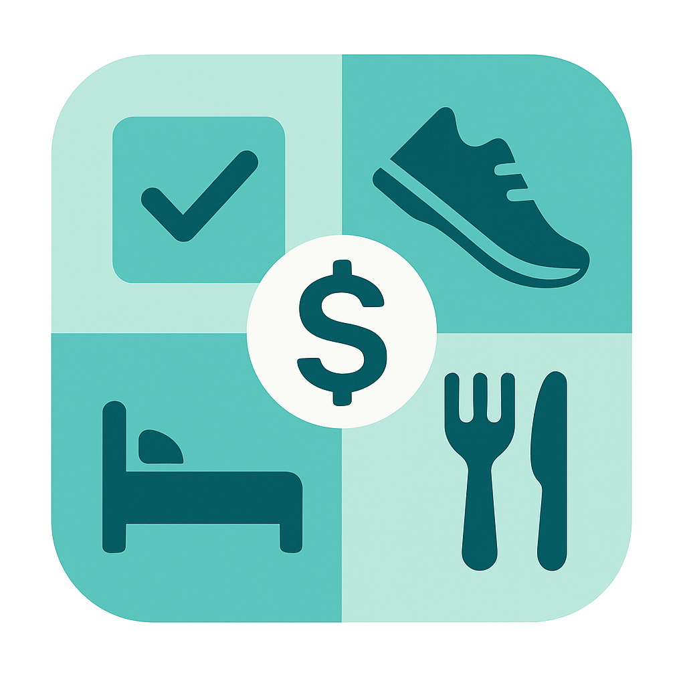

# 🚀 Life Dashboard

A comprehensive personal tracking application to improve productivity, monitor health metrics, and build consistent habits.

## 🌟 Overview

Life Dashboard is a web-based application designed to help you track and visualize all important aspects of your life in one central location. It serves as a comprehensive dashboard for monitoring your tasks, finances, physical activity, sleep patterns, and nutrition, helping you maintain a balanced and productive lifestyle.

The application uses a weekly sprint system and point-based gamification to motivate consistent progress across multiple life domains.

Visit the live application at: [life.felipeadeildo.com](https://life.felipeadeildo.com)

## 🎯 Purpose

Modern life demands that we keep track of numerous responsibilities, habits, and health metrics. Life Dashboard aims to:

- 🕒 Reduce procrastination through clear deadlines and visual progress tracking
- ✅ Improve accountability with systematic habit tracking
- 📊 Provide data-driven insights about personal productivity and health
- 🏆 Generate motivation through a points-based reward system
- 🔄 Create a unified environment for all personal metrics

## ✨ Key Features

### 📋 Dashboard
- **Weekly overview**: Snapshot of all your metrics in one place
- **Points history**: Track your productivity points over time
- **Activity heatmap**: Visualize your daily activity patterns
- **Quick add**: Rapidly input data for all tracking categories

### 📝 Task Management
- **Kanban board**: Organize tasks into "To Do", "In Progress", and "Done" columns
- **⏱️ Time tracking**: Built-in timer for tasks to track effort
- **Weekly rollover**: Automatically move incomplete tasks to the next week
- **Priority system**: Tag tasks by importance, urgency, and complexity

### 💰 Finance Tracking
- **Expense logging**: Record and categorize expenses
- **Category breakdown**: Visual representation of spending patterns
- **Weekly summaries**: Monitor spending trends over time

### 💪 Health Monitoring
- **😴 Sleep tracking**: Record sleep time, wake time, and quality
- **🏃‍♂️ Exercise logging**: Track different types of physical activity
  - Detailed running metrics (distance, pace, type)
  - Gym workout tracking (sets, reps, weights)
- **🍎 Meal tracking**: Monitor caloric intake and meal patterns

### 📈 Metrics and Analytics
- **Weekly points system**: Gamified approach to motivate consistency
- **Progress visualization**: Charts and graphs for all metrics
- **⚖️ Weight tracking**: Monitor weight changes over time

## 🔒 Data Privacy

All data is stored locally in your browser using IndexedDB, ensuring complete privacy of your personal information. No data is sent to any server, providing you with full control over your personal information.

## 📖 Usage Guide

### Setting Up Your Dashboard
1. Start by entering your current weight in the weight tracker
2. Create your first weekly task list
3. Begin logging your activities, meals, and sleep patterns

### Weekly Planning
Each Monday, review your dashboard and:
1. Set goals for the week
2. Create tasks with priorities
3. Plan your workout schedule

### Daily Tracking
1. Log your sleep from the previous night
2. Track meals throughout the day
3. Record exercises as you complete them
4. Use the time tracker while working on tasks
5. Log expenses as they occur

### Weekly Review
Each Sunday:
1. Review your point totals
2. Analyze which areas need improvement
3. Celebrate your achievements
4. Let uncompleted tasks roll over to next week

## 🙏 Acknowledgments

- Inspired by productivity systems like Pomodoro, Kanban
- Built as a solution to combat procrastination and improve personal accountability